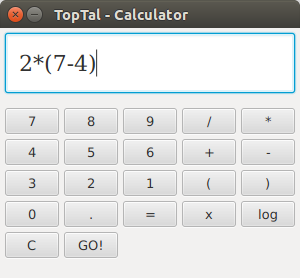

# TOPTAL Calculator


## Introduction

This project is part4 of the [interview](http://www.toptal.com/top-3-percent) for joining [Toptal](www.toptal.com).


## Specification

Text of the task is given in the file **task.txt**


## Technology

Calculator is implemented in Scala programming language. ScalaFX library was used for Calculator's
 GUI implementation and sbt for project building.
   
   
## Requirements

* Java 8
* ScalaFX 8 
* Scala 2.11
* sbt 0.13.8


## Run calculator

Enter the project  folder and type:

 ```
 sbt run
 ```
 
 
## Tests
 
 Tests are located in folder **/src/test/scala-2.11**,  For running all tests enter the project folder and type:
 
 ```
 sbt test
 ```
 
## Library dependencies

* scalatest - test driven development
* scalafx - modern library for GUI
* scala-logging - for logging

More details about project libraraies (e.g. version etc..) can be found in file **build.sbt**


## Logs

Logs are located in **logs** folder.  Log settings are located in **resources/logback.xml**


## ScalaDocs

ScalaDocs can be generated by entering project folder and typing:

```
sbt doc
```

ScalaDoc will be generated in folder **scalaDoc**.  Open file **index.html** in browser in order to start 
browsing projects documentation


## Using a calculator

After running calculator will show up in the center of the screen as shown on the next image:





### Buttons

Here's the list of the available buttons: 

*     &nbsp;&nbsp;&nbsp;  to &nbsp;&nbsp;&nbsp;   are numbers 
*     &nbsp;&nbsp;&nbsp; are used for linear equation
*     &nbsp;&nbsp;&nbsp;  clear, delete all
*     &nbsp;&nbsp;&nbsp;  operations
*     &nbsp;&nbsp;&nbsp;  logarithm
*    &nbsp;&nbsp;&nbsp;  brackets
*    &nbsp;&nbsp;&nbsp;  point for floating point numbers
*    &nbsp;&nbsp;&nbsp;  calculate!


## Functionality 


### Calculations


This functionality supports addition, subtraction, multiplication, division, log on floating point and integer numbers.
 
 e.g.
 
 ```
 (2+(4-1))*5
 ```
 
 A number of samples is given in test file **CalculatorSpec.scala**.
 
 
 Source files that are implementing this functionality are:
 
 * Calculator.scala
 * TokenParser.scala
 * ShuntingYard.scala
 
 
 Calculator.scala object has 2 methods : *calculate* and *rpn*.   Method *calculate* is a high level  workflow that goes from
 receiving input string, parsing it to tokens, transforming to postfix and evaluating.  All these sub-functionalities are
  handled in separate methods.  e.g. method *rpn* evaluates postfix expression.
  
  
 Normally humans tend to enter math expressions in inflix notation and that is what is expected as input to calculator. 
 However , machines are more suitable  for evaluating postfix notation so workflow of data goes like this:
 
 * get inflix notation as input
 * create tokens by applying regex (method *getTokens* from Object **TokenParser**)
 * transform tokens to postfix notataion (method *infixToPostfix* from Object **ShuntingYard**)
 * Finally evaluate postfx and return value to GUI (method *rpn* from Object **Calculator**)
 
 Probably the most interesting part is **ShuntingYard** algorithm. High overvie of algorithm is:
 
 1. Loop through the tokens
 2. In case of operand, push to the  operand stack
 3. In case of operator:
 While there is an operator on top of the operator stack of precedence higher than or equal to that of 
 operator we are currently processing, pop it  and apply.
 Next, push the current operator on the operator stack.
 4. When we get to the end of the formula, apply any operators remaining on the stack, from the top down. 
 Then the result is the only item left on the operand stack (assuming well-formed input).
 
 Here are few good resources for understanding this algorithm in details:
 
 * [oxfordmathcenter](http://www.oxfordmathcenter.com/drupal7/node/628)
 * [wikipedia](https://en.wikipedia.org/wiki/Shunting-yard_algorithm)
 
 For evaluating that posfix notation again stack is used and it is pretty straight forward as shown in 
  method **rpn** in file Calculator.scala  Here , the biggest catch is to make sure that *logarithm* is unary 
  operand. 


### Simple linear equation


 
 
 
 


